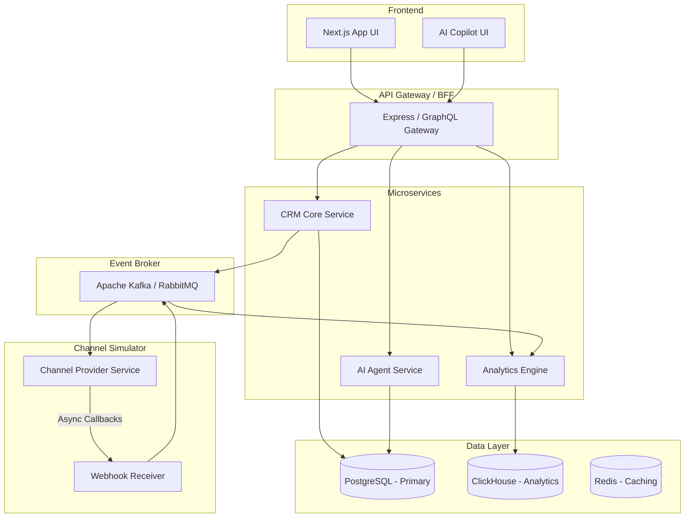
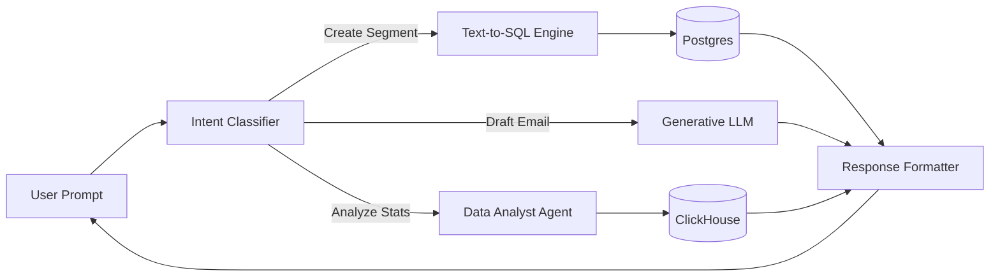
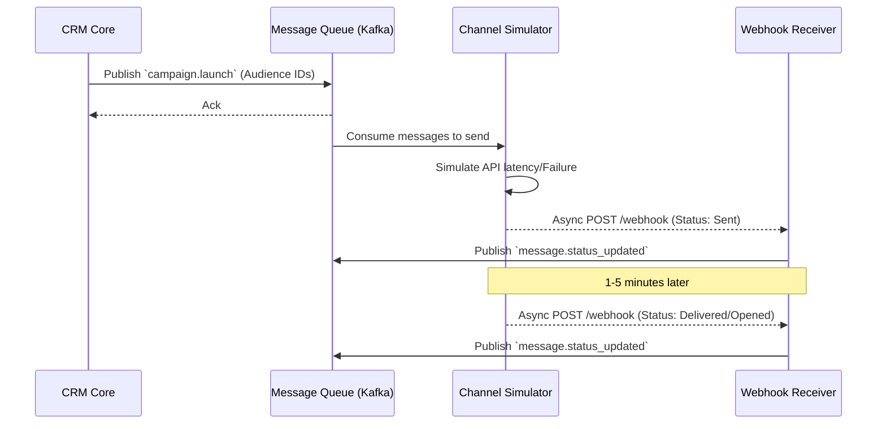
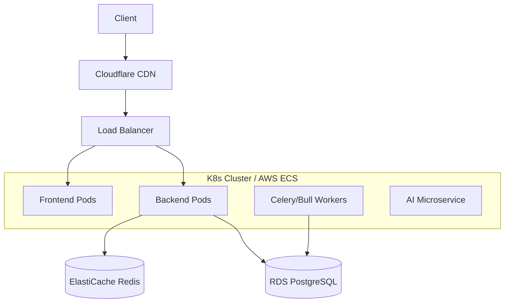

# 🚀 AI-Native CRM: Comprehensive System Design & Architecture

> **A collaborative masterplan designed by a cross-functional dream team:** Senior CRM Product Manager, Marketing Automation Expert, AI Agent Architect, ML Engineer, System Design Expert, Growth Marketer, Data Scientist, and SaaS Founder.

---

## 1. Product Vision
**"The Self-Driving Marketing OS for Modern D2C Brands."**
Most CRMs are glorified databases requiring manual heavy lifting. Our AI-Native CRM flips the paradigm: it acts as an autonomous marketing team. By unifying customer data, predictive AI, and generative agents, it doesn't just execute campaigns—it proposes them, predicts their revenue impact, writes the copy, and optimizes send times automatically.

## 2. User Personas
1. **Sarah, The Growth Marketer**: Cares about ROI, ROAS, and conversion rates. Needs to quickly launch campaigns without SQL knowledge. *Pain point: Waiting on data teams for segments.*
2. **David, The CRM/Lifecycle Manager**: Cares about retention, LTV, and reducing churn. Builds complex customer journeys. *Pain point: Clunky automation builders and generic messaging.*
3. **Elena, The SaaS Founder/Executive**: Cares about topline revenue and overall engagement metrics. *Pain point: Lack of actionable insights from existing fragmented tools.*

---

## 3. Feature Prioritization

| Phase | Core / MVP | Advanced / V2 (Differentiators) |
| :--- | :--- | :--- |
| **Data** | Customer & Order ingestion (REST API) | Streaming data ingestion (Kafka/Kinesis) |
| **Segmentation** | Rule-based (Spend > X, City = Y) | Natural Language Segmentation & Intent Scoring |
| **Execution** | Manual email/SMS send | Autonomous Campaign Agent (Next-Best-Action) |
| **Tracking** | Delivery, Open, Click, Convert webhooks | Multi-touch attribution & Revenue Impact Forecasting |
| **AI** | Generative AI message drafting | Send-time optimization & Churn Prediction models |

---

## 4. Detailed Database Schema (PostgreSQL)

```sql
-- Customers Table
CREATE TABLE customers (
    id UUID PRIMARY KEY,
    name VARCHAR(255),
    email VARCHAR(255) UNIQUE,
    phone VARCHAR(50),
    city VARCHAR(100),
    lifetime_value DECIMAL(10,2),
    churn_risk_score FLOAT, -- AI updated
    created_at TIMESTAMP DEFAULT CURRENT_TIMESTAMP
);

-- Orders Table
CREATE TABLE orders (
    id UUID PRIMARY KEY,
    customer_id UUID REFERENCES customers(id),
    amount DECIMAL(10,2),
    status VARCHAR(50),
    created_at TIMESTAMP
);

-- Segments Table
CREATE TABLE segments (
    id UUID PRIMARY KEY,
    name VARCHAR(255),
    rules JSONB, -- Stores AST of segment rules
    audience_size INT,
    created_at TIMESTAMP
);

-- Campaigns Table
CREATE TABLE campaigns (
    id UUID PRIMARY KEY,
    segment_id UUID REFERENCES segments(id),
    name VARCHAR(255),
    channel VARCHAR(50), -- email, sms, whatsapp
    status VARCHAR(50), -- draft, scheduled, running, completed
    created_at TIMESTAMP
);

-- Communications (Event Log)
CREATE TABLE communications (
    id UUID PRIMARY KEY,
    campaign_id UUID REFERENCES campaigns(id),
    customer_id UUID REFERENCES customers(id),
    channel VARCHAR(50),
    status VARCHAR(50), -- sent, delivered, opened, clicked, failed
    delivery_metadata JSONB,
    updated_at TIMESTAMP
);
```

> [!TIP] 
> For high-volume production, the `communications` table should be migrated to a columnar database like **ClickHouse** or Apache Druid for sub-second analytical queries.

---

## 5. Complete System Architecture



---

## 6. API Design

**RESTful Endpoints:**
* `POST /api/v1/customers/ingest` - Batch insert customers.
* `POST /api/v1/orders/ingest` - Ingest purchase events.
* `POST /api/v1/segments` - Create a segment (accepts JSON rules or Natural Language).
* `POST /api/v1/campaigns` - Create a campaign.
* `POST /api/v1/campaigns/{id}/launch` - Triggers message dispatch to queue.
* `POST /api/v1/webhooks/delivery` - Receives async updates (delivered, opened).
* `POST /api/v1/ai/copilot` - Conversational endpoint for the AI Agent.

---

## 7. AI Architecture



---

## 8. Event Flow Diagrams

**Message Dispatch & Callback Lifecycle:**



---

## 9. Campaign Workflow
1. **Define**: Marketer chats with AI: *"Find users in Mumbai who haven't bought in 3 months."*
2. **Predict**: Simulation Engine runs against historical data: *"Estimated reach: 5,400. Expected Conversion: 2.1%. Expected Revenue: ₹3.4L."*
3. **Generate**: AI drafts personalized WhatsApp templates.
4. **Launch**: Dispatched to queue.
5. **Monitor**: Real-time websocket updates on Dashboard via ClickHouse aggregations.

---

## 10. Machine Learning Models Required
1. **Churn Prediction (XGBoost)**: Predicts probability of churn in next 30 days based on recency, frequency, monetary (RFM) velocity.
2. **Customer Lifetime Value (BTYD / Gamma-Gamma)**: Predicts 12-month future value to optimize acquisition spend.
3. **Send-Time Optimization (Random Forest)**: Evaluates historical open timestamps to output individual-level optimal send hours.
4. **Generative Copy (Gemini 1.5 Pro / GPT-4o)**: Prompt-chained models for hyper-personalized copy generation.

---

## 11. Tech Stack Recommendation
* **Frontend**: Next.js 14, TailwindCSS, Recharts, Lucide Icons, Zustand.
* **Backend**: Node.js (Express/NestJS) for Core API; Python (FastAPI) for ML/AI Microservices.
* **Database**: PostgreSQL (Better-SQLite3 for MVP), ClickHouse (Analytics), Redis (Queue/Cache).
* **AI Provider**: Google Gemini API (Function calling & speed) / OpenAI.
* **Queue**: BullMQ (Redis) for MVP -> Apache Kafka for Enterprise.

---

## 12. Deployment Architecture



---

## 13. Scalability Considerations
* **Queue-Based Dispatch**: Never block the main API thread. Campaign launches push job IDs to Redis/Kafka. Workers pull and execute in chunks of 1,000.
* **Database Partitioning**: Partition the `communications` table by `created_at` (monthly) to keep indexes small and queries fast.
* **Webhook Throttling**: Use queue buffers for incoming webhooks from channel providers to prevent DB connection exhaustion during massive campaigns.

## 14. Security Considerations
* **Row-Level Security (RLS)**: Enforce tenant isolation at the database level if multi-tenant.
* **PII Encryption**: Encrypt `email` and `phone` at rest.
* **Rate Limiting**: Protect the `/ai/copilot` endpoint from abuse using Redis sliding windows.
* **Idempotency Keys**: Ensure webhook retries don't double-count opens/clicks.

---

## 15. Dashboard Design
* **Top Ribbon**: Global Revenue, Active Campaigns, Total Reach, Average Conversion.
* **Center Canvas**: Interactive funnel chart (Sent -> Delivered -> Opened -> Clicked -> Converted).
* **Right Sidebar**: AI Copilot sticky chat interface.
* **Bottom Panel**: Real-time ticker of incoming orders and AI predictive alerts (e.g., *"Segment 'VIPs' showing 15% higher churn risk this week"*).

## 16. UI/UX Screens
1. **The Command Center (Dashboard)**: High-level metrics.
2. **Audience Studio**: Visual rule builder + Natural language input bar.
3. **Campaign Canvas**: Drag-and-drop journey builder for multi-channel steps.
4. **Copilot Overlay**: Command+K / Ctrl+K interface to summon the AI from anywhere.

---

## 17. Demo Dataset Design
To make the demo "pop", generate 100,000 realistic rows:
* **Demographics**: Indian tier-1 and tier-2 cities (Mumbai, Delhi, Bangalore, Pune).
* **Purchases**: Fashion brand data (Summer dresses, Sneakers, Accessories).
* **Seasonality**: Spikes around Diwali and End of Reason Sale (EORS).
* **Varying Engagement**: 20% highly active, 50% dormant, 30% sporadic to show the AI's ability to find hidden segments.

---

## 18. Walkthrough Video Script (2 Mins)
**[0:00 - Hook]** *(Upbeat tech music. Screen shows the Dashboard.)* 
"Meet Lumière CRM. The first CRM that doesn't just store data, it acts on it."

**[0:15 - AI Segmentation]** *(Typing into the AI chat)* 
"Instead of writing complex SQL, I just tell Xena, our AI agent: *'Find my highest spenders in Mumbai who haven't bought sneakers in 3 months.'* Boom. 4,500 users found instantly."

**[0:40 - Campaign & Simulation]** *(Screen shows predictive numbers)*
"Before I even launch, the Simulation Engine predicts a 3.2% conversion rate and ₹5 Lakhs in revenue. Xena drafts hyper-personalized WhatsApp messages for each user."

**[1:10 - Launch & Analytics]** *(Clicking Launch, seeing real-time charts)*
"I hit launch. Behind the scenes, a highly scalable event-driven architecture processes thousands of messages asynchronously. Watch the real-time funnel update as delivery and open webhooks stream in."

**[1:45 - Outro]** 
"Scalable, intelligent, and built for modern growth. This is the future of marketing."

---

## 19. Interview Questions and Answers

**Q: How do you handle a scenario where the Channel Provider goes down while sending a 1 million user campaign?**
**A:** Because we use an event-driven architecture with a message broker (Kafka/RabbitMQ), messages are pulled from the queue, not pushed. If the provider goes down, the worker fails to send, the message returns to the queue, and we implement an Exponential Backoff retry mechanism. No data is lost, and the system gracefully handles the outage.

**Q: How does the AI Copilot access the database without causing performance degradation or executing dangerous SQL?**
**A:** We use a strict Semantic Layer and Tool Calling. The AI never runs raw SQL. Instead, it predicts the parameters for predefined, optimized APIs (e.g., `create_segment(field, operator, value)`). For analytics, we route AI queries to a read-replica or an OLAP database (ClickHouse) so the primary transactional DB is never impacted.

---

## 20. Standout Features for Hiring Evaluations
To blow an engineering interviewer away, emphasize these technical differentiators in the project:
1. **True Agentic Workflow**: The AI isn't just an LLM wrapper; it utilizes function calling to actually execute state-changing actions in the database.
2. **Resilient Webhook Simulation**: Demonstrating knowledge of idempotency, retry jitter, and asynchronous processing using the Channel Simulator shows senior-level distributed systems knowledge.
3. **Data Engineering Chops**: Mentions of transitioning from Postgres to ClickHouse for the `communications` table shows foresight into OLTP vs. OLAP workloads at scale.
4. **Predict-Before-You-Send**: Implementing a basic statistical model to forecast campaign revenue shows deep product-engineering synergy.
